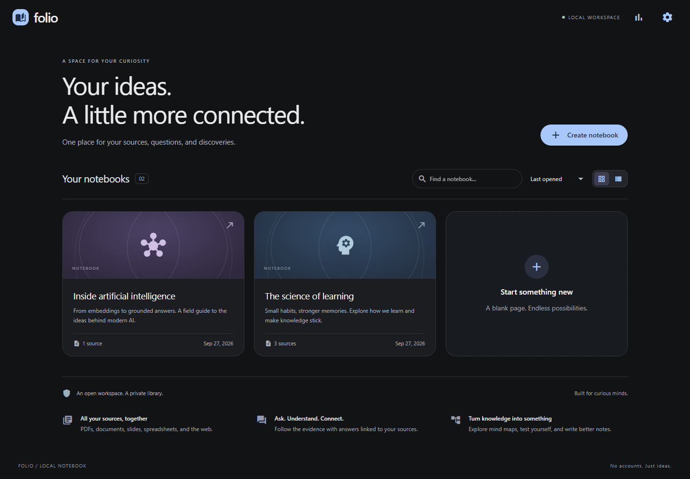
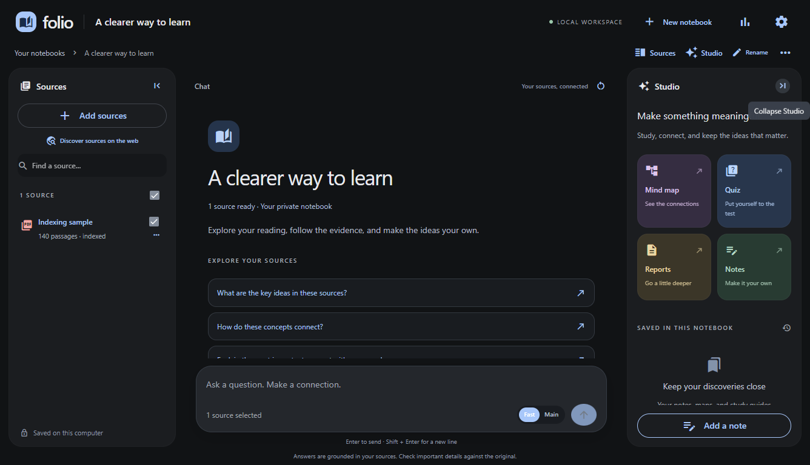

Folio · Local Notebook
======================

**Your sources. Your models. Your workspace.**

A local, open-source study application inspired by NotebookLM, authored in Python. Bring documents, ask questions with source citations, and turn the evidence into mind maps, quizzes, reports, and notes. No application account, sharing service, or subscription.



What works
----------

- Notebook creation, search, grid/list views, renaming, deletion, and restart persistence.
- A charcoal Sources → Chat → Studio workspace with collapsible sidebars, remembered layouts, mobile panel tabs, source search, and reduced-motion support.
- Stage-based indexing progress with passage counts, elapsed time, cancellation, and animated generation feedback.
- PDF, DOCX, PPTX, XLSX, CSV, TSV, TXT, Markdown, HTML, JSON, and image ingestion. OCR is available for scans; legacy Office files use an optional LibreOffice conversion adapter.
- Public website/PDF imports, pasted text, browser-based discovery, and optional integrated Wikipedia/Gemini search.
- LlamaIndex sentence chunking and a typed retrieval workflow; local BGE embeddings, LanceDB vectors, SQLite FTS5/BM25, reciprocal rank fusion, and a MiniLM cross-encoder reranker.
- Streaming Gemini chat, selected-source filtering, clickable evidence locations, stop generation, and saved conversations. Without a model connection, the app explains how to configure .env; it never substitutes excerpts for an answer.
- Structured, validated mind maps and quizzes; quiz scoring with explanations; source-grounded reports.
- Agent-callable Studio tools: Data Analytics, Spreadsheet, and Deep Research, with inline charts/tables, Excel/CSV downloads, and saved results.
- Autosaved Markdown notes, answer-to-note capture, and PDF/Markdown/JSON downloads with retained source references where available.
- `gemini-3.8-flash` and `gemini-3.5-flash-lite`, plus an OpenAI-compatible adapter for local or remote endpoints.
- Project `.env` configuration, local data ownership, bounded ingestion batches, duplicate detection, and restart checkpoints.
- Fast/Main chat switch, visible streaming status, reusable local embedding cache, and a retrieval benchmark dashboard with downloadable judgments.



Run on this computer
--------------------

The project environment and local models are already installed in `E:\NoteBookLM`.

```powershell
cd E:\NoteBookLM
.\run.ps1
```

Open **http://127.0.0.1:8080**. If it is already running, open that address directly instead of starting a second server. Stop a foreground server with Ctrl+C.

Use the sun/moon button in the header to switch between dark and white themes; the choice is saved locally. Notebook cards have a trash button with a confirmation before deletion.

Choose **Agent** beside the answer model, or ask to search online in **Auto** mode. The agent retrieves selected notebook documents, chooses web searches, reads promising pages, follows links, and refines document or web queries when evidence is missing. Comparisons with “our text” use document and website evidence together, with labeled citations for each. Context space is reserved for both, and a citation check retries comparisons that omit one side. Unselected documents remain excluded. Search uses DuckDuckGo with multi-engine fallbacks. **Web pages are read in memory, never imported or indexed by the agent.** Explicit Add sources → Website imports remain available separately.

The expandable Agent activity shows document retrieval, web searches and reads; Stop cancels the run. Quick search uses up to two searches, four page reads, six decisions, and 75 seconds per research task. It cannot read every website, private pages, or sites that block access. Missing evidence is disclosed rather than presented as a completed comparison. **Sources** mode uses only selected notebook sources; **Auto** chooses the agent for online requests and referential follow-ups to web answers. Comparison tables preserve readable label widths and scroll horizontally on narrow screens.

Agentic Studio
--------------

Every Studio tool dialog has a minimize button in its top-right corner. Minimized jobs continue while you use the notebook, with status entries in Studio to restore or cancel them. Completed jobs stay minimized until you open them; their outputs are saved normally. Keep the notebook page open while jobs run (these are page-session tasks, not durable jobs across reloads or server restarts).

Open **Studio → Data Analytics, Spreadsheet, or Deep Research**, or ask in chat: “Quick search Avatar cast and production details, chart its box-office revenue, and create a spreadsheet.” A small model-driven planner selects tools and splits independent research questions. Up to two quick research tasks (three for deep research) run concurrently. Data tools share one prepared dataset, so charts and spreadsheets use the same values. Fast/Main selects the answer model, not research depth.

- **Data Analytics:** tables, bar/line/pie charts, grouped sum/mean/count/min/max, and calculated summaries. CSV/TSV/XLSX calculations read the original selected tables rather than sampled retrieval passages. The first row is treated as headers; blank numeric cells are excluded from numerical aggregates. XLSX formulas use saved cached values. Other documents and websites use quoted, cited extracted rows, clearly marked as incomplete datasets.
- **Spreadsheet:** formatted Excel with Data, Summary, and Sources sheets, plus supporting quotes when extracted from evidence; CSV download is also available. Raw data strings cannot become spreadsheet formulas. The first version selects one table per request; it does not implement joins, arbitrary Python, pivot tables, or unrestricted transformations.
- **Deep Research:** explicitly requested multi-query search, website reading, linked-page exploration, and a detailed cited report. Each task is bounded to 10 searches, 24 page reads, 26 decisions, and seven minutes; the report uses the available context and discloses gaps. It requires web access and does not run in Sources-only mode.

Results appear below the chat answer and are saved in Studio. Chat charts and downloads persist after reload; deleting a Studio artifact does not remove its saved chat snapshot. Stop cancels in-flight async tasks. A failed research branch does not discard successful branches. Source tables are limited to 50,000 rows / 500,000 cells, and charts to 200 points; oversized inputs are rejected rather than silently producing partial totals. Downloads contain all result rows; the UI previews up to 500.

Run `python -m pytest tests/test_agent_tools.py -q` for tool checks and `python scripts/agent_ui_check.py` for the isolated Windows/Edge UI smoke test. The latter uses deterministic model/search fixtures and does not verify live provider or website availability.

Fresh installation
------------------

Python 3.11 is the tested runtime. The UI and business logic are Python; NiceGUI supplies its browser runtime. No separate JavaScript project or Node build is required.

```powershell
python -m venv .venv
.\.venv\Scripts\python.exe -m pip install -e '.[dev,ocr]'
.\.venv\Scripts\python.exe scripts\download_models.py
.\.venv\Scripts\python.exe -m local_notebook.main
```

On Linux/macOS, use `.venv/bin/python` instead. PDF export needs DejaVu Sans on Linux or the installed Segoe UI font on Windows. The exact verified Windows dependency snapshot is in `requirements-lock-windows.txt`; use that file only on Windows, then install this package with `pip install -e . --no-deps`.

First model setup downloads approximately 100–200 MB of embedding/reranker assets, depending on packaging and cache behavior. Subsequent retrieval runs locally. OCR has an optional package installation; LibreOffice is needed only for old `.doc`, `.ppt`, and `.xls` files. An `advanced` extra reserves Docling/sentence-transformers for future adapters; those packages are not used by the current default pipeline.

Connect a model
---------------

1. Open the project [`.env`](.env). On a fresh checkout, copy `.env.example` to `.env` first.
2. Fill in `GEMINI_API_KEY` with your own key:

   ```dotenv
   GEMINI_API_KEY=your_key_here
   GEMINI_FAST_MODEL=gemini-3.5-flash-lite
   GEMINI_MAIN_MODEL=gemini-3.8-flash
   ```

3. Restart the server, then open **Settings → Test connection**.

The project `.env` is loaded at startup, regardless of the working directory. Values in the project file take precedence over inherited process variables, including a blank key. This prevents a previous environment key from silently taking over your new setup. Only the two Gemini model IDs above are allowed. Gemini settings in the database cannot override them. A transient failure can retry the selected model once before any text arrives; it never switches models automatically. There is no key-entry dialog or credential-store fallback. `.env` is ignored by Git; `.env.example` contains no secret.

Gemini chat defaults to **Fast** (your Flash-Lite model); switch to **Main** in the composer when you want Flash. Studio also defaults to the fast model. Settings exposes Gemini thinking effort and a 16- or 40-candidate reranking shortlist. Higher effort and broader reranking take longer. Model service load can still delay the first token.

For a local OpenAI-compatible server, select **Local / compatible**, set its base URL (for example `http://localhost:11434/v1`), and enter a model installed on that server. If authentication is required, set `NOTEBOOK_API_KEY` in `.env` and restart. A remote endpoint must use HTTPS. Compatibility depends on the endpoint's streaming and JSON-output support; the adapter has been checked against a local SSE contract fixture, not every model vendor.

The application is free. Cloud API usage, search quotas, and provider account requirements are controlled by the provider. Cloud generation sends your question and retrieved evidence to that provider. Local storage does not make a cloud model offline.

Try a three-minute demo
-----------------------

1. Open the included **The science of learning** notebook. Its sample texts are original demonstration notes, clearly labeled as such.
2. Ask “How do retrieval practice and spaced practice work together?”
3. Open a citation, then deselect a source and ask a follow-up.
4. Generate a mind map, a two-question quiz, and a short report from Studio.
5. Save an answer as a note, edit it, export a PDF, and reload to demonstrate persistence.

Verification
------------

The chat RAG workflow now has a separate [conversation and answer evaluation suite](docs/RAG_EVALUATION.md), including follow-ups, topic switches, full-index lookup, source isolation, unanswerable questions, and live citation/claim checks. Open `/benchmarks` for per-case results. Missing model access no longer substitutes pasted source excerpts for an answer.

The September UI/indexing refresh reduced the isolated 1,000-page ingestion fixture from **14.57 s to 8.68 s**. See the [UI changes, benchmark comparison, and validation scope](docs/UI_REFRESH.md).

- **47 automated tests** passed locally, covering parsing/OCR, isolation, citations, recovery, embedding reuse, candidate budgets, source overviews, PDF export, SSE parsing, and local origin checks.
- An isolated headless Edge run passed **17 browser checks with a real Gemini connection**. Fast chat became visible in **2.40 s**; a small mind map took **3.48 s**, a two-question quiz **2.42 s**, and a short report **2.92 s**. These are single-run observations, not service guarantees.
- Four deterministic browser checks verified a visible waiting state, partial streaming before completion, stopping chat, and cancelling Studio without saving an artifact.
- A **10,000-page synthetic digital PDF** exercises ingestion and cached reindexing, followed by five exact-record probes with the reranker off. See the [generated measurement table and raw results](docs/VERIFICATION.md#10000-page-benchmark) for the current timings, memory, and probe outcomes.
- Live Flash and Flash-Lite connections and a public URL import were verified.

These are scoped measurements, not broad accuracy or production-readiness claims. The synthetic benchmark uses short, simple pages and excludes OCR and complex layouts. See [verification details](docs/VERIFICATION.md).

```powershell
.\.venv\Scripts\python.exe -m pytest -q
.\.venv\Scripts\ruff.exe check src tests scripts benchmarks
.\.venv\Scripts\python.exe scripts\browser_check.py
.\.venv\Scripts\python.exe scripts\streaming_check.py
.\.venv\Scripts\python.exe scripts\ux_check.py
.\.venv\Scripts\python.exe benchmarks\scale.py --pages 10000 --semantic
.\.venv\Scripts\python.exe benchmarks\retrieval.py
.\.venv\Scripts\python.exe benchmarks\rag.py
.\.venv\Scripts\python.exe benchmarks\plot.py
```

`scripts/browser_check.py --live` runs generation against a configured real provider and consumes its quota. Browser checks use an isolated library and Edge profile. The browser test script currently targets an installed Microsoft Edge browser.

System design
-------------

See the [architecture diagrams and runtime flows](docs/ARCHITECTURE.md) and [updated implementation plan](PROJECT_PLAN.md). They distinguish the current implementation from planned improvements.

Retrieval quality and speed
---------------------------

Open **Retrieval benchmarks** in the top bar, or visit `/benchmarks`. Compare keyword, hybrid, and two reranking budgets on **54 labeled questions over 40 authored passages**. The [measured results table](docs/RETRIEVAL_BENCHMARK.md) and chart are generated from the same saved JSON. Current runs use three repetitions with randomized configuration and question order; this remains a small development fixture.


The separate live answer report currently **fails its evaluation gates** and needs judge review. It is not a validated answer-accuracy score.

This small developer-authored fixture measures finding labeled evidence, **not perfect generated-answer accuracy**. It is not an independent held-out evaluation. The committed [query-level results](src/local_notebook/assets/retrieval-benchmark.json) expose every ranking and timing. See [methodology and limits](docs/RETRIEVAL_BENCHMARK.md).

Data and configuration
----------------------

Runtime data lives under `.data/`, which is excluded from Git. It contains SQLite metadata, originals, search indexes, model caches, and logs. `NOTEBOOK_DATA_DIR`, `NOTEBOOK_MODEL_DIR`, and `NOTEBOOK_PORT` override the defaults. `NOTEBOOK_EMBED_THREADS` controls local embedding CPU threads (1–8; defaults to at most 4). `NOTEBOOK_NO_SAMPLE=1` disables first-run samples. `NOTEBOOK_OFFLINE=1` disables model generation for testing; chat asks for a model connection rather than returning raw excerpts.

To back up, stop the app and copy the whole data directory. Restore it while the app is stopped. Credential-store keys are outside that directory. The server binds only to loopback and checks HTTP and WebSocket host/origin boundaries. This is a single-user local app, not a shared hosted service.

Known boundaries
----------------

- Integrated Wikipedia search was blocked by the upstream endpoint in this environment. Gemini search returned a provider quota error. Browser search and direct public URL import remain available; neither bypasses paywalls or private documents.
- Broad Studio overviews sample sections within a bounded context. They explicitly warn when not every passage is covered. Full-corpus hierarchical summarization is future work.
- The default compact embedding/reranking models prioritize CPU use and English. Multilingual retrieval quality has not been benchmarked.
- Parsing is best effort. Complex formulas, merged cells, chart semantics, handwritten scans, unsupported encodings, and proprietary formats may need a different source export. Spreadsheet extraction preserves row/sheet context; it is not a spreadsheet calculation engine.
- No audio/video overview generator, login-based Google Drive import, collaboration, or deployment service is included.
- Citation IDs and locations are validated, but this does not prove every generated claim is entailed. Verify important answers against original evidence.

Read the [architecture](docs/ARCHITECTURE.md), [demo and résumé guide](docs/RESUME_GUIDE.md), and [contribution notes](CONTRIBUTING.md). Licensed under [MIT](LICENSE). Independent project; not affiliated with Google or NotebookLM.
