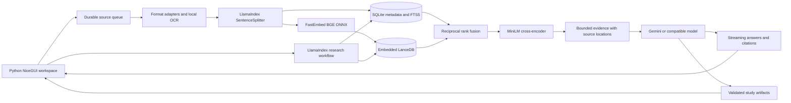

Architecture
============

Folio is a single-user Python web application. NiceGUI provides the browser components and FastAPI transport; all application UI definitions, event handlers, storage, retrieval, and generation logic are authored in Python. Dedicated CSS files supply the visual design.

Storage boundaries
------------------

SQLite owns notebooks, sources, passage text, conversations, artifacts, and non-secret settings. A source has a content hash, location, parsing status, selected flag, and checkpoint counters. Foreign keys cascade metadata removal. FTS5 triggers maintain the keyword index when passage rows are inserted or removed.

LanceDB stores 384-dimensional BGE vectors with passage, source, and notebook identifiers. Retrieval scopes are applied before vector ranking and also checked against ready, selected sources in SQLite. Passage IDs are deterministic within the current splitter version. Model/column naming fixes the vector space; changing embedding dimensions requires a new table and reindexing.

API keys stay in server memory unless the user requests the OS credential store. Environment keys are supported. Keys are excluded from notebooks, artifacts, and exported files. Runtime folders are ignored by version control.

Ingestion and recovery
----------------------

Uploads are bounded at 150 MB each; URL downloads are capped at 25 MB. The application hashes bytes and deduplicates imports within a notebook. It checks Office ZIP expansion bounds and uses generated storage filenames.

A single dedicated worker thread reads durable `queued` source rows. It extracts page/row/section units, splits them with LlamaIndex, and writes batches of about 128 passages. ONNX inference uses two threads and 16-item embedding batches. Documents are kept out of the UI event loop. Cancellation is checked between parsed units; a native parser call already in progress cannot be interrupted immediately.

A local SQLite embedding cache keys vectors by model identifier and text SHA-256. Repeated text and reindexing reuse computed embeddings. The cache remains inside the private data directory, including after a source is deleted; it stores vectors and digests, not duplicate source text. Removing `embedding-cache.db` while the app is stopped safely clears it. LanceDB table handles are reused per data directory. Model initialization is locked, while query inference no longer waits on a lock held throughout an ingestion batch.

On restart, interrupted sources return to the queue. A checkpoint skips already committed passage ordinals during reparsing; extraction itself is not cached or resumed at a binary-file offset. Vector merge-upserts and SQLite insert-ignore operations make replay idempotent. A manual reindex starts fresh. Only `ready` sources participate in answers, preventing partially imported evidence from leaking into retrieval.

This implementation uses a worker thread, not the separate process pool proposed in the initial plan. It provides bounded work, persistence, and simple Windows installation. Parser-process isolation and multi-worker coordination are future extensions.

Retrieval decisions
-------------------

1. Short follow-ups include the last user question as retrieval context.
2. SQLite FTS5/BM25 and dense vector search each return up to 40 scoped candidates.
3. Reciprocal rank fusion merges result rankings using `1 / (60 + rank)`.
4. A batched SQLite query fetches the fused shortlist; the optional ONNX cross-encoder reranks 16 candidates by default, or 40 in the broader Settings mode.
5. A bounded number of passages fit within an explicit text budget; chat normally selects eight.
6. A LlamaIndex `Workflow` moves retrieval into a worker thread and returns typed evidence to the UI.
7. The provider receives evidence, bounded conversation history, and source-only instructions.
8. Citation references are checked against provided passage IDs; links open the original evidence location.

Query embeddings have a bounded in-memory cache; ranked results are not cached, so source selection and deletion take effect immediately. Generic key-idea/source-summary requests sample distributed source sections instead of searching literal overview phrases. The UI reports that this is sampled coverage. The [retrieval benchmark](RETRIEVAL_BENCHMARK.md) measures Recall@8, MRR@8, nDCG@8, and latency on a public development fixture.

The 10,000-page benchmark uses exact vector scanning in embedded LanceDB. An approximate nearest-neighbor index is not necessary to achieve the measured performance on that fixture; it should be evaluated for larger or denser corpora. Relevance evaluation must cover semantic paraphrases and unanswerable questions before claiming general accuracy.

Generation and artifacts
------------------------

Gemini uses `google-genai` asynchronous streaming. Fast chat selects Flash-Lite; the composer can switch to the main Flash model. Supported Gemini Flash models receive a configurable thinking level, defaulting to minimal. The compatible adapter parses OpenAI-style SSE deltas from `/chat/completions` and defaults to its main model. Remote endpoints require HTTPS, with a localhost exception for local models. No user-controlled code execution or model tool execution is enabled in ordinary chat.

Chat keeps a visible waiting state until a token arrives, renders incremental Markdown with a short update throttle, follows new output while the reader is near the bottom, and displays time to first words separately from retrieval latency. Cancelling preserves partial chat text. Studio shows an elapsed stage indicator; cancelling stops the task without saving an unfinished artifact.

Quizzes and mind maps are JSON validated with Pydantic. Quiz answer indexes and source numbers are checked; mind maps have bounded depth, and leaves require evidence. Reports use Markdown and checked citation IDs. The UI renders interactive quiz scoring and ECharts trees through NiceGUI's Python API. Notes autosave to SQLite and preserve citations when derived from an answer or report.

Studio uses the fast model by default, with an opt-out in Settings. Topic requests retrieve up to 12 passages. Broad overviews sample up to 12 distributed sections within a 30,000-character evidence budget. Only included passages can be cited; coverage warnings are retained in artifacts and exports. This is deliberately not described as exhaustive synthesis of a 10,000-page library.

Local boundary
--------------

The server listens on `127.0.0.1`. An ASGI middleware verifies hosts and origins for both HTTP and WebSockets, including the NiceGUI event channel. URL imports reject private-network addresses and recheck each redirect. This is basic defense for a local tool, not a claim of a formal security audit or protection against malicious code already running as the local user.

The UI renders model Markdown with the framework's sanitization. Native document macros and scripts are never executed. Original files are served as downloads with `nosniff`. Browser mutations and exports do not expose arbitrary filesystem paths.

Project map
-----------

| Module | Responsibility |
| --- | --- |
| `main.py`, `config.py` | Startup, routes, local access boundary, configuration |
| `storage.py` | SQLite schema and persistence operations |
| `ingestion/` | File/URL adapters, discovery, durable jobs, checkpoints |
| `retrieval/` | Embeddings, vector storage, hybrid search, reranking, LlamaIndex workflow |
| `providers.py`, `chat.py` | Model adapters, prompt evidence, streaming, citations |
| `studio.py`, `exports.py` | Validated generation and artifact exports |
| `ui/` | Python pages, dialogs, panels, and small CSS files |
| `tests/` | Behavioral unit/integration checks |
| `scripts/`, `benchmarks/` | Reproducible browser tests and performance measurements |
