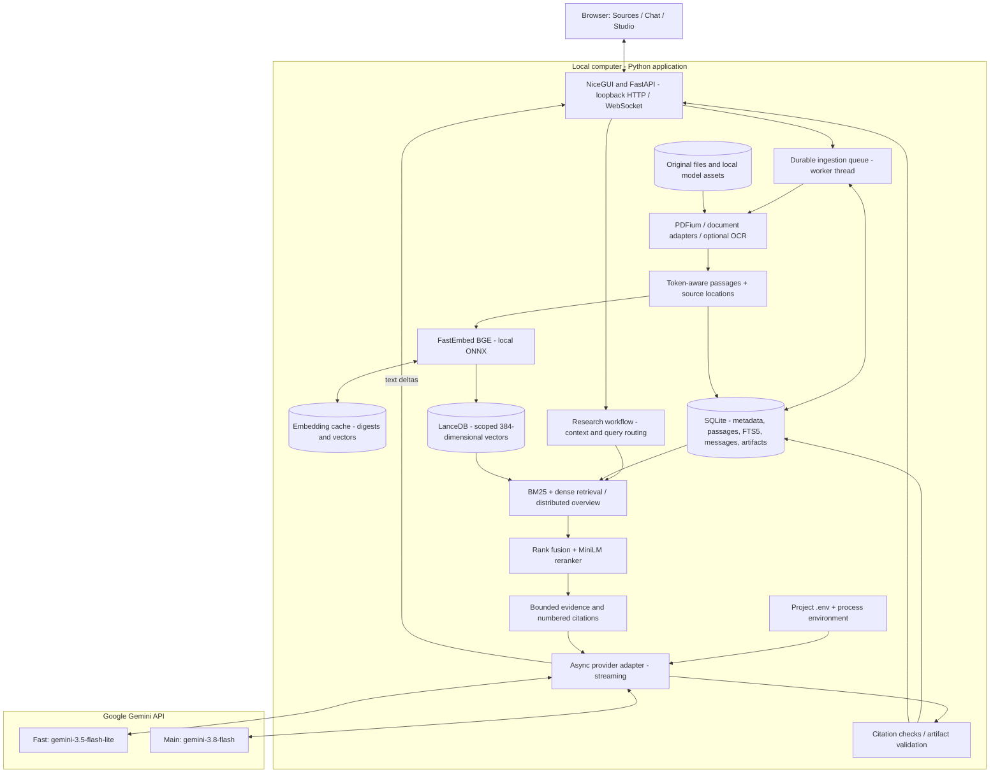
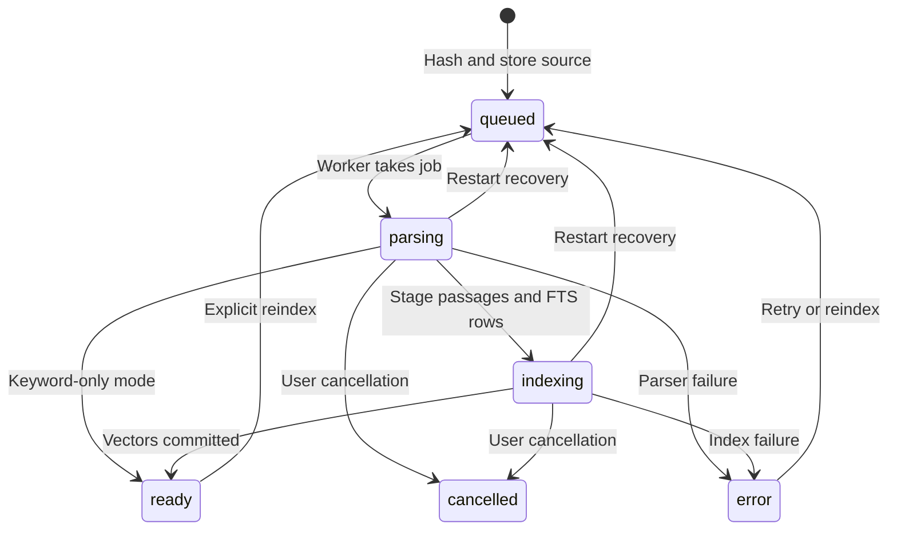
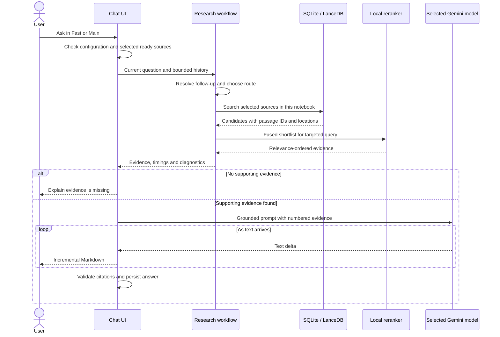

# Folio system architecture

Folio is a local, single-user RAG application. Documents are parsed, indexed, searched, reranked, and linked to evidence on this computer. Gemini receives the question, bounded conversation history, and selected evidence to generate an answer. Text extraction is the first stage of indexing, not the answer engine.

This document describes the implemented system as of September 29, 2026. Future work is separated in [the implementation plan](../PROJECT_PLAN.md).

## Components and deployment

There is no external vector service, application account, Redis queue, or separate frontend build. NiceGUI serves the UI; a small Vue component implements the mind map. Parsing, embedding, and retrieval run outside the UI event loop. A compatible API adapter remains available for explicitly configured local or remote endpoints.

## Configuration and model selection

| Setting | Authority | Default |
| --- | --- | --- |
| Gemini key | `GEMINI_API_KEY` in `.env` or process environment | Empty; user supplies it |
| Fast model | `GEMINI_FAST_MODEL` | `gemini-3.5-flash-lite` |
| Main model | `GEMINI_MAIN_MODEL` | `gemini-3.8-flash` |
| Retrieval and Main thinking preferences | Non-secret SQLite settings | Hybrid + reranker, 16 candidates, minimal thinking |
| Data directory | `NOTEBOOK_DATA_DIR` | `.data` |
| Embedding threads | `NOTEBOOK_EMBED_THREADS` | Half available CPUs, up to 4; configurable from 1 to 8 |

The loader resolves `.env` relative to the project, not the launch directory. Project file values override inherited process variables, including a deliberately blank key. A stale environment key cannot shadow the project file. Editing `.env` requires a restart. Both Gemini model slots accept only the two IDs above. Persisted model names cannot override Gemini environment configuration; obsolete backup settings are discarded. There is no automatic switch to another model.

Keys are not entered through the browser or fetched from the OS credential store. The application does not save keys in SQLite, notebook exports, or artifacts. `.env` is Git-ignored; `.env.example` is a blank template. Connection status exposes presence, never the key. Configuration does not prove that a provider grants access to either model.

## Indexing lifecycle

1. Hash uploaded bytes, reject duplicates within the notebook, and store the original under an internal filename. Uploads are bounded at 150 MB; URL downloads at 25 MB.
2. Stream page, row, or section units through adapters. Digital PDFs use PDFium; scans can use local OCR. Location metadata travels with every passage.
3. Semantic indexing uses the embedding tokenizer: 384 tokens with 48-token overlap, preferring sentence boundaries. Keyword-only indexing uses LlamaIndex sentence splitting. All parsed units are processed, not just the first pages.
4. Stage text in SQLite batches of 256. FTS5 triggers maintain the keyword index. Report parsed units and passage counts.
5. Read batches of 64 passages for vector insertion. Reuse embeddings by SHA-256 of model identifier and passage text. Uncached inference uses batches of 32 for short text and 16 for longer passages, with length ordering to reduce padding.
6. Upsert vectors, then advance the durable checkpoint. Only completed sources become `ready` and eligible for retrieval. Check cancellation between parser units and batches.

SQLite WAL and committed checkpoints make progress durable. Interrupted jobs are requeued, reparsed, and already committed vector ordinals skipped. Deterministic IDs and upserts make replay idempotent. Extraction does not resume from a PDF byte offset. SQLite and LanceDB do not share a transaction; the ready-state gate prevents partial imports from entering answers.

Indexing time depends on text volume, passage length, CPU, model startup, and OCR. The current embedding path is CPU-based; a GPU does not automatically accelerate it. Changing the embedding model or chunking contract requires a versioned rebuild and retrieval evaluation.

## Question-to-answer flow

Targeted retrieval searches the full index of selected, ready sources. Explicit new topics stand alone; referential follow-ups use prior context. Compound-name matching and comparison aspects supplement query matching. BM25 and dense search each return up to 40 candidates. Reciprocal rank fusion uses `1 / (60 + rank)`; optional MiniLM reranking scores a shortlist of 16 or 40. Duplicate text is removed. Chat normally keeps eight passages within the retrieval text budget, then packs evidence and labels into a 30,000-character prompt budget. Low reranker relevance can trigger abstention; this threshold is a heuristic requiring evaluation.

Broad overviews use distributed source coverage rather than literal search for “key ideas.” Up to 80 passages are sampled across sources and document positions. Context packing preserves breadth instead of consuming the budget at the beginning of a book. This is bounded synthesis, not an exhaustive review in one API request. Full-document hierarchical synthesis is planned separately. All successfully parsed text is searchable, while each answer uses a bounded evidence set.

The model is instructed to use evidence, cite factual claims, and abstain when unsupported. Citation checks confirm IDs exist in the prompt; they do not prove entailment. Links retain source locations. Prior conversation is not accepted as fresh documentary evidence.

## Streaming and failure handling

- Gemini connections are reused per event loop and credential. Fast and Studio default to the configured Flash-Lite; Main selects the configured Flash. Fast requests minimal thinking independently of the Main setting.
- Text deltas render incrementally with UI throttling. A normal question does not wait for a separate model call for query rewriting or a title.
- Fast has a 20-second first-text deadline per attempt. Main and later stream gaps use a 60-second idle deadline. The operation has a 300-second overall bound.
- Transport failures, timeouts, and selected 5xx errors retry the same model once, only before any text is delivered. Authentication, missing-model, and quota errors surface without an automatic model switch.
- After partial output, the app preserves the answer and reports the interruption. Stop/cancel closes the stream. Manual retry and switching Fast/Main remain user actions.
- Missing configuration explains how to fill `.env` and restart. Provider errors remain visible with retry controls. Raw excerpts are not substituted for generated answers.

Retrieval latency, indexing elapsed time, and generation time to first text are separate measurements. A provider timeout after successful retrieval does not mean embeddings are slow. Remote API latency is not guaranteed.

## Studio and presentation

Studio retrieves topic evidence or distributed overview coverage. Quizzes use an 18,000-character evidence budget; other outputs use up to 30,000. Pydantic validates quiz answers and mind-map structure. Mind maps allow up to 80 nodes, require source references on leaves, and offer colored branches, individual expansion, expand/collapse all, zoom and an interactive canvas. Reports use Markdown and citation checks. Notes and validated artifacts persist locally and export with available source references.

## Persistence and trust boundaries

| Store | Contents | Lifecycle |
| --- | --- | --- |
| `.data/notebook.db` | Sources, notebooks, passages/FTS, messages, artifacts, non-secret preferences | Durable; metadata deletions cascade |
| `.data/vectors/` | Passage vectors with notebook/source IDs | Rebuilt on reindex; scope-filtered before ranking |
| `.data/embedding-cache.db` | Text/model digests and vectors | Reused across imports; survives source deletion |
| `.data/originals/` | Original documents | Private local source storage |
| `.data/models/` | Local model assets | Reused across runs |
| `.env` | Provider key and model configuration | Local, ignored by Git |

The server binds to loopback and checks HTTP/WebSocket hosts and origins. URL imports reject private-network destinations and recheck redirects. Ordinary chat does not execute source instructions, macros, or model tools. Gemini web discovery is a separate explicit operation. Cloud generation sends retrieved text outside the computer; local indexing does not make cloud generation offline. This is a local application boundary, not multi-user authorization.

## Evaluation and release gates

The [RAG evaluation protocol](RAG_EVALUATION.md) separates retrieval quality from answer quality.

| Layer | Evidence |
| --- | --- |
| Ingestion | Token bounds, passage/page locations, checkpoint recovery, cancellation, embedding reuse |
| Retrieval | Recall@8, MRR@8, nDCG@8, topic switches, follow-ups, isolation, abstention |
| Answers | Reference completeness, correctness, citation validity, claim support with evidence quotes |
| Runtime | First text, partial-stream recovery, same-model retries, cancellation, no legacy-key fallback |
| Browser | No key prompt, environment guidance, streaming, persistence, responsive UI and mind maps |

Run unit tests, Ruff, isolated browser checks, and the keyword RAG gate without API access. Run hybrid evaluation after retrieval changes. Run live generator/judge evaluations with the configured Gemini pair once the user supplies a key. Model judgments are fallible; contradictory or unverifiable judgments need human review. Developer fixtures and historical timings do not establish arbitrary-book accuracy or availability of the configured endpoints.

## Code map

| Module | Responsibility |
| --- | --- |
| `config.py`, `main.py` | Environment, startup, local access boundary |
| `storage.py` | SQL schema, persistence and non-secret settings |
| `ingestion/` | Parsers, jobs, chunking, recovery, discovery |
| `retrieval/` | Embeddings, vectors, fusion, reranker, workflow |
| `providers.py`, `chat.py` | Streaming, retry boundaries, prompts, citations |
| `studio.py`, `exports.py` | Structured generation and exports |
| `ui/` | NiceGUI pages, controls, mind-map component, CSS |
| `evaluation.py`, `benchmarks/`, `tests/`, `scripts/` | Metrics, fixtures, performance and browser checks |
