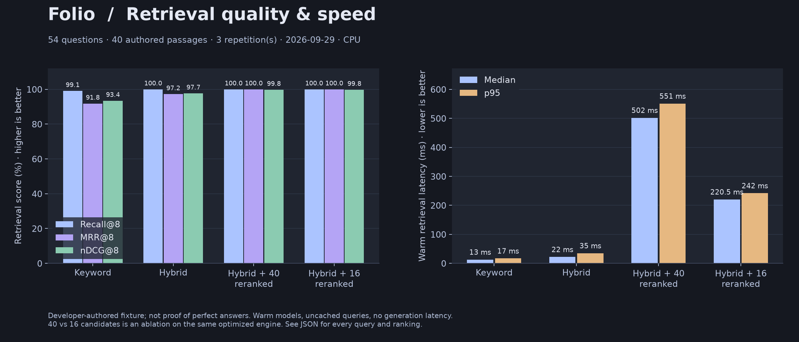

Retrieval benchmark · September 2026
===================================

The benchmark runs the actual SQLite FTS5, BGE-small embedding, LanceDB, reciprocal rank fusion, and MiniLM reranking pipeline. No language-model API participates in this measurement. The UI at `/benchmarks` reads the committed result and offers the complete JSON for download.



<!-- retrieval-results:start -->
Measured 2026-09-29 · 54 questions · 40 authored passages · 3 repetition(s) per configuration.

| Configuration | Recall@8 | MRR@8 | nDCG@8 | Median | p95 |
| --- | ---: | ---: | ---: | ---: | ---: |
| Keyword | 0.9907 | 0.9182 | 0.9343 | 13 ms | 17 ms |
| Hybrid | 1.0000 | 0.9722 | 0.9767 | 22 ms | 35 ms |
| Hybrid + 40 reranked | 1.0000 | 1.0000 | 0.9977 | 502 ms | 551 ms |
| Hybrid + 16 reranked | 1.0000 | 1.0000 | 0.9977 | 220.5 ms | 242 ms |

Generated from [raw query results](../src/local_notebook/assets/retrieval-benchmark.json). Latencies cover warm retrieval only, excluding answer generation.
<!-- retrieval-results:end -->

The 40- and 16-candidate configurations are shortlist comparisons on the same engine. Repeated timings describe this machine and fixture, not guaranteed speedups on other collections. The previous single-pass result is retained in [benchmark history](benchmark-history/retrieval-2026-09-28.json).

Protocol
--------

- The original fixture in `benchmarks/corpus.py` contains 24 study passages, 16 distractors, 48 direct/paraphrased questions, and 6 questions requiring two passages. Topics cover machine learning, retrieval, databases, and study techniques.
- Relevance judgments are authored with the fixture. A relevant passage is identified by its stable fixture ID. Comparisons require both labeled passages.
- Each configuration searches the same isolated index. Current runs repeat each configuration three times, randomizing configuration and question order with a recorded seed. Model sessions are warmed with a different question; query-embedding caches are cleared before every configuration/repetition. Measured questions are unique within each repetition. Quantiles aggregate all samples, and the JSON also records repetition medians. This controls some order effects but is not a confidence interval across independent machines or processes.
- Recall@8 is the fraction of labeled passages found in the first eight results. MRR@8 is the reciprocal rank of the first relevant passage. nDCG@8 evaluates placement of all relevant passages with binary relevance and logarithmic rank discounts. Scores are macro-averaged over questions.
- Median and nearest-rank p95 cover retrieval only. Indexing, initial model loading, network requests, generation, and browser rendering are excluded. The JSON includes warmup time separately.
- Both reranker configurations use the optimized engine; this is a shortlist ablation, not a historical software-version comparison. Their cross-encoder batches contain eight passages.
- Python 3.11.9, Windows, 12 logical CPUs, approximately 16 GB RAM; embedding thread count is recorded in current reports; the reranker uses two inference threads. Historical reports may omit these settings. All query rankings, timings, platform details, and the fixture SHA-256 are in the result file.

Limits
------

This is a small **developer-authored development fixture**, not an independent held-out test. Prepared passages are inserted directly, so this suite does not evaluate parsing or chunking. Short passages and a compact candidate pool make it easier than a full textbook library. Several queries share vocabulary with their evidence. Perfect Recall@8 on this fixture does not establish perfect retrieval, entailment, factual accuracy, or answer completeness on user documents.

Unanswerable questions, multilingual text, OCR errors, contradictory evidence, dense tables, and long-document semantic accuracy are not evaluated here. A dense retriever can return neighbors even when no answer exists. The generation prompt asks for abstention, but this benchmark does not measure that behavior. Future evaluation should use a larger independent corpus with explicit negative judgments and citation-support scoring.

Reproduce
---------

```powershell
.\.venv\Scripts\python.exe benchmarks\retrieval.py
.\.venv\Scripts\python.exe benchmarks\plot.py
.\.venv\Scripts\python.exe benchmarks\publish.py
.\.venv\Scripts\python.exe benchmarks\publish.py --check
```

Run after installing the project development extra and downloading the local embedding/reranker models. The runner uses a fresh `test-results` directory and refuses to report degraded keyword fallback as hybrid results. It replaces `src/local_notebook/assets/retrieval-benchmark.json`; the plotter creates PNG and SVG figures in `docs/images`, and the publisher updates the measured table above. CI checks metric arithmetic, the table, and chart provenance against the report. A rerun on another machine will have different timings.

Additional measured improvements
--------------------------------

A timing-only check on an existing 437-passage PDF reduced warm retrieval from approximately 3.7 s to 1.3 s across the same three queries. Its contents and query-level evidence are not published. This diagnostic is separate from the public relevance fixture.

The current synthetic 10,000-page ingestion and reindex measurements are generated from the raw report in [VERIFICATION.md](VERIFICATION.md#10000-page-benchmark). These are single-run observations, not a controlled multi-run confidence interval; page text is short and no OCR is involved. Historical before/after runs are retained separately and should not be interpreted as guaranteed speedups.

An isolated live browser run measured 2.40 s until the first visible Fast-mode answer, 3.48 s for a three-leaf mind map, 2.42 s for a two-question quiz, and 2.92 s for a short report. These use one short original source and Flash-Lite. During separate probes Flash reported high demand and took 9–12 s to deliver the first token, while Flash-Lite took 1.2–1.8 s. Provider demand and answer size affect latency independently of retrieval.

Gemini's official [thinking documentation](https://ai.google.dev/gemini-api/docs/thinking) describes the latency/reasoning tradeoff. The app exposes thinking effort and uses `minimal` for supported Gemini Flash models by default. The Fast/Main control makes the chosen model explicit.
