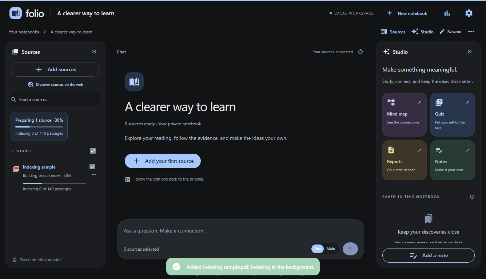
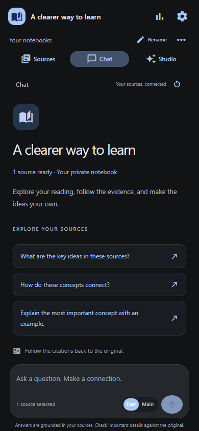

UI and indexing refresh · 27 September 2026
==========================================

The workspace now uses a neutral charcoal palette with blue focus and action colours. Sources and Studio collapse into narrow rails; that preference is remembered in this browser. Below 1,001 px, Sources, Chat, and Studio become separate tabs, keeping the composer visible. The conversation uses one native scroll container, with a bounded reading width and no horizontal page scrolling.

The refresh also covers the notebook library, upload/import dialogs, settings, notes, source previews, discovery, and Studio. It includes source search, full-name tooltips, keyboard labels, answer copying, source-aware send controls, animated answer placeholders, generation loading bars, and reduced-motion support.

Indexing and progress
---------------------

- Text extraction and chunk creation run first, staging bounded batches to SQLite. Embedding batches then run against the known passage total. The UI shows the active stage, passage counts, progress, and elapsed time. Unknown extraction totals use an indeterminate bar. 100% is reserved for a completed index; the percentage is stage weighted, not a prediction of time remaining.
- Progress controls update in place instead of rebuilding the source list for each passage count.
- Native PDFium text extraction replaces the slower Python path where available, retaining pypdf as a fallback. OCR retains its separate optional dependency. PDF page and text handles are explicitly closed.
- Embedding work groups similar-length passages to reduce padding and uses up to four CPU threads by default. `NOTEBOOK_EMBED_THREADS` overrides the thread count (1–8).
- Cancellation cannot be overwritten by a finished batch. Interrupted indexing resumes from committed embedding checkpoints. Imports interrupted under the older parser restart from the original document after migration.
- Existing notebooks, originals, conversations, notes, and ready indexes remain available. New imports and explicit reindex operations use the new pipeline.

Measured comparison
-------------------

Same Windows computer, Python 3.11.9, 12 logical CPUs, a generated 1,000-page digital PDF with approximately 40 words per page, semantic search enabled, a fresh isolated embedding cache for each run. Models were already downloaded. Each figure is one run; this is not a general accuracy or performance guarantee.

| Measurement | Before | After |
| --- | ---: | ---: |
| Initial ingestion | 14.57 s | 8.68 s |
| Throughput | 68.64 pages/s | 115.23 pages/s |
| Cached reindex | 2.12 s | 1.06 s |
| Peak process RSS | 430.5 MB | 420.4 MB |
| Exact-record retrieval probes | 5/5 | 5/5 |
| Embedding CPU threads | 2 | 4 |

Initial ingestion took 40.4% less time in this fixture; cached reindexing took 50% less time. Scans, long passages, tables, and complex PDFs can take substantially longer. Sampling the existing machine-learning PDFs also checked text retention and page locations; this was not a full-document quality audit.

Validation
----------

Final result: **47 Python tests and 31 browser checks passed**, with no JavaScript errors in the checked flows.

- Python regression suite: parsing, OCR, password-protected PDFs, fallback extraction, retrieval isolation, embedding order, progress, cancellation, and restart recovery.
- Existing offline browser checks: uploads, chat, citations, note autosave, PDF download, persistence, settings, and benchmark views.
- `scripts/ux_check.py`: mind-map citation clicks (including tree nodes without numeric values); real 140-page PDF indexing progress; source filtering/selection; sidebar collapse and reload persistence; mobile tab navigation; source preview; reduced motion; composer visibility and absence of page overflow at 1336×768, 1366×629, 1024×768, 768×1024, 390×844, and 320×640.
- `scripts/streaming_check.py`: a deterministic local provider verifies visible waiting, partial streaming, preserving a stopped answer, and cancelling Studio without saving an artifact. No paid provider calls are required.

Run checks with the project virtual environment. Browser results and screenshots are saved under `test-results/`; indexing benchmarks use isolated libraries and do not modify personal notebooks.

